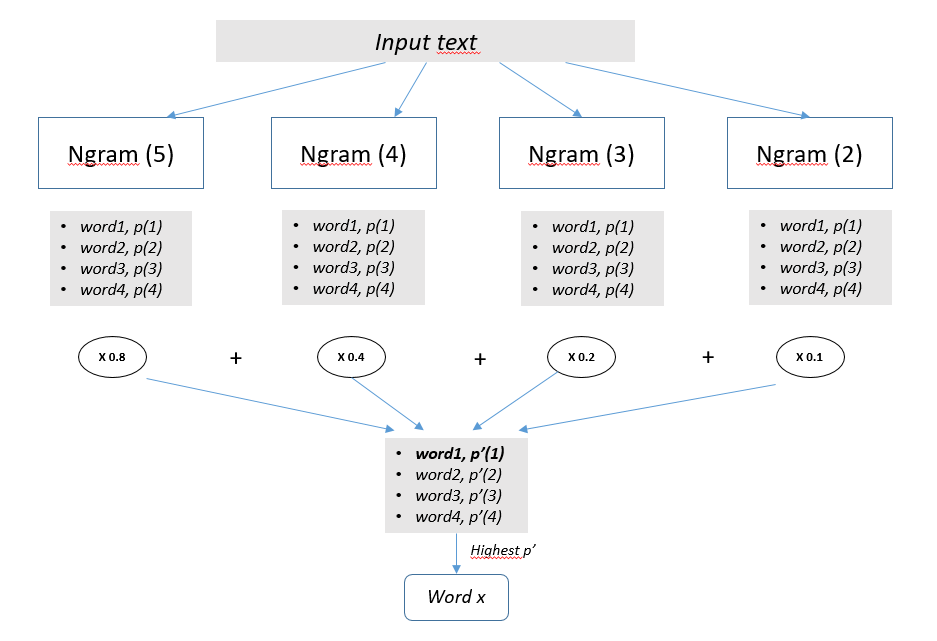

```{r setup, include=FALSE}
knitr::opts_chunk$set(echo = TRUE)

library(ggplot2)
library(corpus)

setwd("D:/GIT_REPOSITORY/DataScienceCapstone")
source(".//tfTools.R")

```

## Objective

The objective of this project is to apply data science in the area of natural language processing
to create a prototype of a Text Predictor application similar to what the mobile text editors are using
when they suggest some text to introduce based on previous words.

To create this application we are going to use a dataset ("Corpora") that includes texts collected from twitter,
blogs and news data sources.

In this document I will report the result of the exploratory data analysis of the dataset and the planned strategies
to develop the text predictor.


## Opening the dataset

As I mentioned before the dataset is composed by 3 different text files:

- en_US.twitter.txt
- en_US.blogs.txt
- en_US.news.txt

I have built some R code to read these files and load them into R objects in a efficent way, saving
the objects locally so, the next time I need to  load the objects I can avoid to download and read the text
files again.

```{r, echo = F, eval = T, results='hide', messages=F, warning=F, cache=TRUE}
setwd("D:/GIT_REPOSITORY/DataScienceCapstone")
source(".//tfTools.R")

dataset <- importDataSet()

```

## Dataset Basic Summary

Once I have loaded the dataset I can get some basic features such as:

- the number of lines:

```{r cache = TRUE}
summary(dataset)
```

- the number of words:

```{r cache = TRUE}
library(ngram)
wordcount(dataset$twitter)
wordcount(dataset$blogs)
wordcount(dataset$news)
```

## Cleaning the dataset

To manipulate the dataset I'm going to use the library "corpus" which has several functions
for NLP such as the obtention of datagrams.

when loading the dataset into corpus objected by default the library is doing some cleaning and processo operations, 
such us manage the case issued and other possibilities. The by default options are the following:


```{r cache = TRUE}
library(corpus)
corpusList = list("twitter", "blogs", "news")

corpusList$twitter <- as_corpus_text(dataset$twitter)
corpusList$blogs <- as_corpus_text(dataset$blogs)
corpusList$news <- as_corpus_text(dataset$news)

text_filter(corpusList$news)

```

To decide if other type of processing is required, I will obtain the 3-grams of one
of the dataset to see the current results:

```{r cache = TRUE}
term_stats(corpusList$news, ngrams = 2:3)
```

As can be observed, there area some problems due to punctuations and symbols that can be a problem
for the predictor. So I will remove all these components in all the datasets:

```{r }
text_filter(corpusList$twitter)$drop_symbol = TRUE
text_filter(corpusList$twitter)$drop_number = TRUE
text_filter(corpusList$twitter)$drop_punct = TRUE

text_filter(corpusList$blogs)$drop_symbol = TRUE
text_filter(corpusList$blogs)$drop_number = TRUE
text_filter(corpusList$blogs)$drop_punct = TRUE

text_filter(corpusList$news)$drop_symbol = TRUE
text_filter(corpusList$news)$drop_number = TRUE
text_filter(corpusList$news)$drop_punct = TRUE
```


## Plots and advanced features of the dataset (n-grams)

To create the text predictor is required to see what type of n-grams can be obtained 
from the dataset.

To do this, I'm obtaining the ngrams from 2 to 8 with a minimum of 2 concurrences and I will plot
the number of occurrences per type of ngram.

First of all I'll take a sample of 50% of the corpus to save time and memory. And then I'm
plotting the number of occurrences of the different sizes of n-grams.

```{r cache = TRUE, echo = FALSE}
# get the corpus with a 50% of sampling
corpusList <- getCleanedCorpus(dataset, 0.5)
```


```{r cache = TRUE}
ngramsList <- list("twitter", "blogs", "news")

ngramsList$twitter <- term_stats(corpusList$twitter, ngrams = 2:6, min_count = 2, types = TRUE)
ngramsList$blogs <- term_stats(corpusList$blogs, ngrams = 2:6, min_count = 2, types = TRUE)
ngramsList$news <- term_stats(corpusList$news, ngrams = 2:6, min_count = 2, types = TRUE)

```
```{r plot_tw_ngrams, echo = FALSE}

df <- data.frame(type = c(6:2), count = 0)

ng <- ngramsList$twitter

df[1, "count"] = sum(ng[!is.na(ng$type6),"count"])
df[2, "count"] = sum(ng[!is.na(ng$type5),"count"])
df[3, "count"] = sum(ng[!is.na(ng$type4),"count"])
df[4, "count"] = sum(ng[!is.na(ng$type3),"count"])
df[5, "count"] = sum(ng[!is.na(ng$type2),"count"])

ggplot(data = df, aes(x=type, y=count)) +
            geom_bar(stat="identity") + 
            geom_text(label = df$count, vjust = -0.5) +
            ggtitle("Number of n-grams for Twitter dataset") +
            xlab("Size of n-grams")
            


```

```{r plot_bl_ngrams, echo = FALSE}

df <- data.frame(type = c(6:2), count = 0)

ng <- ngramsList$blogs

df[1, "count"] = sum(ng[!is.na(ng$type6),"count"])
df[2, "count"] = sum(ng[!is.na(ng$type5),"count"])
df[3, "count"] = sum(ng[!is.na(ng$type4),"count"])
df[4, "count"] = sum(ng[!is.na(ng$type3),"count"])
df[5, "count"] = sum(ng[!is.na(ng$type2),"count"])

ggplot(data = df, aes(x=type, y=count)) +
            geom_bar(stat="identity") + 
            geom_text(label = df$count, vjust = -0.5) +
            ggtitle("Number of n-grams for Blogs dataset") +
            xlab("Size of n-grams")
            


```

```{r plot_nw_ngrams, echo = FALSE}

df <- data.frame(type = c(6:2), count = 0)

ng <- ngramsList$news

df[1, "count"] = sum(ng[!is.na(ng$type6),"count"])
df[2, "count"] = sum(ng[!is.na(ng$type5),"count"])
df[3, "count"] = sum(ng[!is.na(ng$type4),"count"])
df[4, "count"] = sum(ng[!is.na(ng$type3),"count"])
df[5, "count"] = sum(ng[!is.na(ng$type2),"count"])

ggplot(data = df, aes(x=type, y=count)) +
            geom_bar(stat="identity") + 
            geom_text(label = df$count, vjust = -0.5) +
            ggtitle("Number of n-grams for News dataset") +
            xlab("Size of n-grams")
            


```

According to these results I will select for the text predictor only the n-grams from  2 to 5, since the rest are less
representative.

## Strategies to build the text predictor

Based on previous results my strategy to build the text predictor can be summarized with the following scheme:



I will create several modules to get a list of potential words with probability based on counting the occurrences
of different potential n-grams, where n can be from 5 to 2.

Then I will apply a weight to the different outputs, 0.8 for the higher ngram, and 0.1 for the lower, and then I will obtain
the final probability for each word. Then the word with the highest probability will be selected. 
I will also use a combination of a sample of the three corpus.

